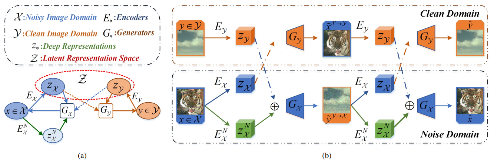
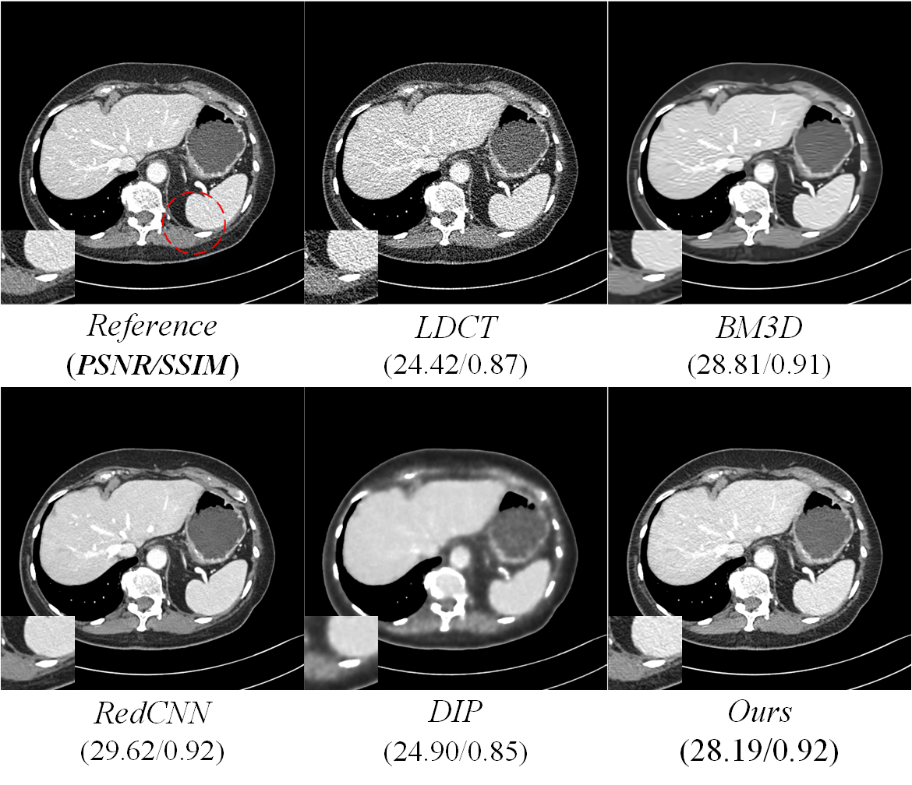

# Learning Invariant Representation for Unsupervised Image Restoration (CVPR 2020)

## Introduction

This is an implementation for the paper **"Learning Invariant Representation for Unsupervised Image Restoration" (CVPR 2020)**, a simple and efficient framework for unsupervised image restoration,which is injected into the general domain transfer architecture, more details could be found in original paper.
  ## Network Architecture

 

Proposed method aims to learn the intermediate representation free of noise from corrupted input that $z_{x}$and align it with $z_{y}$ from clean image in the latent space $Z$. In addition, adversarial domain adaption and self-supervised constraints are introduced into our architecture. As shown in Fig1-(b), our method is more straight and effective than other domain-transfer methods, e.g., [CycleGAN](https://arxiv.org/abs/1703.10593), [UNIT](https://arxiv.org/abs/1703.00848), [DRIT](https://arxiv.org/abs/1808.00948)and so on.

## Prerequisites

* (OS) Windows/Ubuntu
* Python >=3.6
* Pytorch >=1.1.0
* Python-Libs, e.g., cv2, skimage.

## Training

* Prepare your dataset.  In our experiments, we used the [PascalVoc](http://host.robots.ox.ac.uk/pascal/VOC/voc2012/) dataset to generate training data for Gaussian noise removal.
* Generate Gaussian or Poisson noise via skimage-lib.
* update the data paths  in `config.py` and `utils.py` file.
* Train your model by the `train.py` file.

## Test

A simple script to test your model:

`python3 test.py`

## Results

**Gaussian Noise Removal**

 

**Poisson Noise Removal**

 

**Medical Image Denoising (Low-Dose CT)**

 

## Extending for other IR tasks

You could extend this work for other image restoration tasks, e.g., super-resolution, deblurring and so on. If so, you need adjust the some hyperparameters for them, and extra self-supervised modules also need to be altered. In this paper, we just provide a  more general idea to process the unsupervised image restoration tasks via representation learning.

## Acknowledge

Our code is based on the [UNIT](https://github.com/mingyuliutw/UNIT), which is a nice work for unsupervised image translation.
